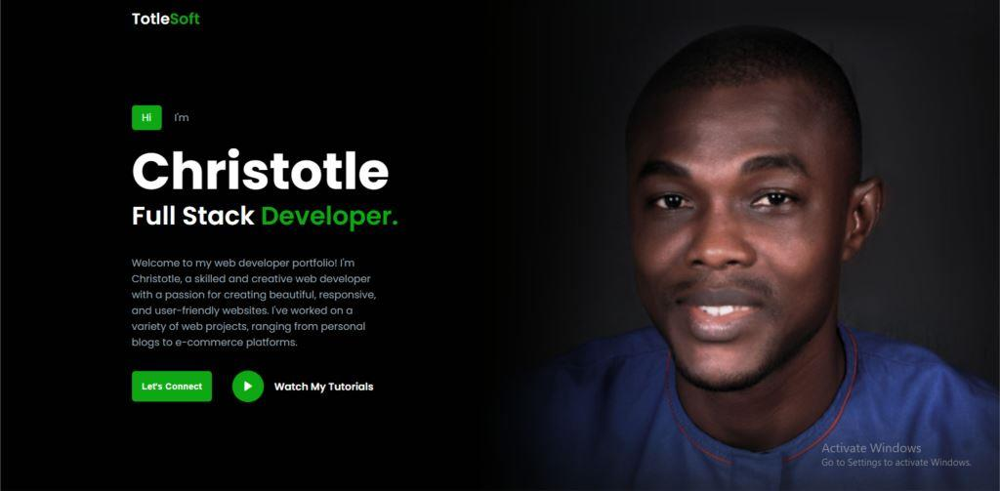
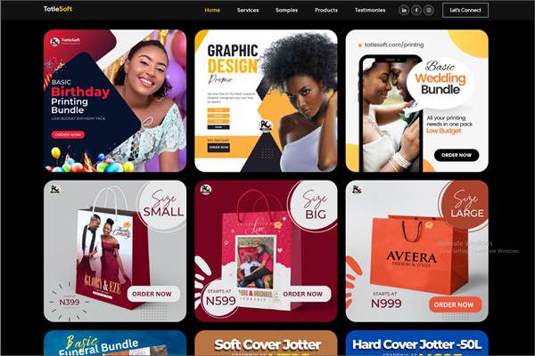
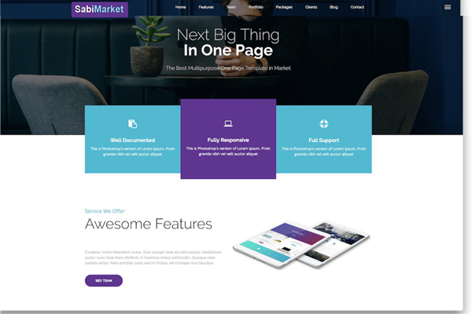
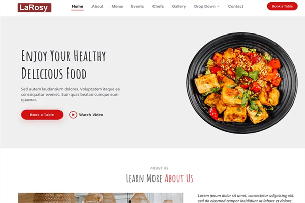

## Totlesoft Web Development Academy (TWDA) Assignment 102
** Design A Simple Responsive Potfolio Website with HTML and CSS Only ** 

[by Agholor Christotle](https://github.com/johnchristotle)


This is a simple project to text your ability after the HTML and CSS basic classes.

### Marketplace




As a beginner in web development, seeking to acquiring knowledge in web development, one of the crucial skills for learners is the ability to build both simple and complex websites. A strong skill for learners is the capability to create a website using only HTML and CSS, without relying on frameworks like Bootstrap.

A website is simply a collection of digital resources, such as web pages and related stuff. It is a digital platform with interactive features, multimedia, and text that is designed to provide users with a variety of information, services, or resources.

In this Assignment, you are to design a contemporary and visually appealing website using HTML and CSS only. The website should feature a logo, a navigation bar, a sidebar menu, and a curved design at the bottom. Additionally, it will be responsive, ensuring it adapts well to different devices and screen sizes as well as have a simple animation effect.

A video tutorial and demo of the website has been uploaded to our Youtube Page [Video Tutorial](https://youtube.com/@iamchristotle) in order to guide you through the process of creating a straightforward, responsive website using HTML and CSS with all the basic features you have been taught so far. Each step will be clearly demonstrated, allowing you to follow along where you are having any challenge.


## Steps To Creating A Simple Responsive Website with HTML and CSS Only

### Source Code:

* A. [Source Code: GitHub](https://github.com/johnchristotle/TotlesoftWDA-Assignment102)

* B. [Source Code: Google Drive](https://drive.google.com/drive/folders/1HRcK8iUfw2mwXFVpbf2uPO45l8tZpfnJ?usp=sharing)


### Let's Begin:

* 1. Create a folder. (You can name this folder whatever you want, and inside this folder, create the mentioned files).

* 2. Create an index.html file. The file name must be index and its extension .html

* 3. Create a styles.css file. The file name must be styles and its extension .css

* 4. A. **Source Code from Google Drive? ** 
* Download the images folder from google drive and put this folder inside the project folder. This folder has all the images that will be used for this website.

* 4. B. ** Source Code from GitHub? **
* Clone the project locally, change into the directory, and install the dependencies:

```sh
git clone https://github.com/johnchristotle/TotlesoftWDA-Assignment102

cd TotlesoftWDA-Assignment102

```

## If you are using just the image resource and doing the coding yourself without using the code from the source (Recommended):

* Begin by adding the following HTML codes to your index.html file: The provided code segment consists of a website header and an unordered list (ul) for website navigation. It also includes a hamburger button that allows toggling of the website’s sidebar in the mobile version and images.

```HTML-CODE
<!DOCTYPE html>
<!-- Coding by Christotle Agholor || https://totlesoft.com/academy -->
<html lang="en">
  <head>
    <meta charset="UTF-8" />
    <meta http-equiv="X-UA-Compatible" content="IE=edge" />
    <meta name="viewport" content="width=device-width, initial-scale=1.0" />
    <link
      href="https://cdn.jsdelivr.net/npm/remixicon@3.0.0/fonts/remixicon.css"
      rel="stylesheet"
    />
    <link rel="stylesheet" href="styles.css" />
    <title>Totlesoft Academy</title>
  </head>
  <body>
    <nav>
      <div class="nav__logo"><a href="#">Totle<span>Soft</span></a></div>
    </nav>
    <header>
      <div class="section__container header__container">
        <p><span>Hi</span> I'm</p>
        <h1>Christotle</h1>
        <h2 class="section__title">Full Stack <span>Developer.</span></h2>
        <p>
          Welcome to my web developer portfolio! I'm Christotle, a skilled and
          creative web developer with a passion for creating beautiful,
          responsive, and user-friendly websites. I've worked on a variety of
          web projects, ranging from personal blogs to e-commerce platforms.
        </p>
        <div class="action__btns">
          <button class="btn">Let's Connect</button>
          <a href="https://www.youtube.com/@iamchristotle" class="video">
            <div class="play">
              <i class="ri-play-fill"></i>
            </div>
            <span>Watch My Tutorials</span>
          </a>
        </div>
      </div>
    </header>
    <section class="about">
      <div class="section__container about__container">
        <div class="about__image">
          
        </div>
        <div class="about__content">
          <h2 class="section__title">About <span>Me</span></h2>
          <p class="section__subtitle">Passionate Web Developer!</p>
          <p class="about__details">
            As a Full Stack Developer, I specialize in the MERN STACK TECHNOLOGY. 
            I have extensive experience
            working with product managers, developers, and other stakeholders to
            gather requirements, create wireframes and prototypes, and conduct
            user testing to ensure that the final product meets the needs of the
            users. Throughout my career, I have achieved several milestones,
            including designing successful digital products that have received
            positive feedback from users and stakeholders.
          </p>
          <a href="https://www.github.com/johnchristotle" target="_blank">
          <button class="btn">Visit my GitHub</button>
          </a>
        </div>
      </div>
    </section>

    <section class="service">
      <div class="section__container service__container">
        <p class="section__subtitle">What I Offer!</p>
        <h2 class="section__title"><span>My</span> Services</h2>
        <div class="service__grid">
          <div class="service__card">
            <i class="ri-smartphone-line"></i>
            <h4>Web Design</h4>
            <p>
              I am dedicated to providing high-quality web design services
              that are tailored to meet the specific needs of my clients.
            </p>
            <a href="https://www.linkedin.com/in/christotle-agholor-0182a288/" class="read__more">Read more...</a>
          </div>
          <div class="service__card">
            <i class="ri-code-s-slash-line"></i>
            <h4>Web Development</h4>
            <p>
              I use the latest web technologies and development tools to create
              websites that are fast, secure, and scalable.
            </p>
            <a href="https://www.linkedin.com/in/christotle-agholor-0182a288/" class="read__more">Read more...</a>
          </div>
          <div class="service__card">
            <i class="ri-edit-2-line"></i>
            <h4>Graphics Design Coach</h4>
            <p>
              My approach is collaborative, and I encourage your feedback
              throughout the design process to ensure that I am meeting your
              expectations.
            </p>
            <a href="https://www.linkedin.com/in/christotle-agholor-0182a288/" class="read__more">Read more...</a>
          </div>
        </div>
      </div>
    </section>

    <section class="project">
      <div class="section__container project__container">
        <p class="section__subtitle">Portfolio</p>
        <h2 class="section__title"><span>Latest</span> Project</h2>
        <div class="project__grid">
          <div class="project__card">
            
          </div>
          <div class="project__card">
            
          </div>
          <div class="project__card">
            
          </div>
          
        </div>
      </div>
    </section>

    <footer>
      <div class="section__container footer__container">
        <div class="footer__content">
          <h2 class="section__title">Contact <span>Me!</span></h2>
          <p class="section__subtitle">If you have any project in mind</p>
          <div class="footer__details">
            <p>
              You can reach me through the contact form provided on this
              website. Simply fill out the form with your name, email address,
              and message, and I will get back to you as soon as possible.
            </p>
            <p>Totlesoft Academy</p>
            <p>Port Harcourt City</p>
            <p>Nigeria</p>
          </div>
          <div class="social__icons">
            <a href="https://www.facebook.com/christotleagholor/" class="icon"><i class="ri-facebook-fill"></i></a>
            <a href="mailto:agholorchristotle@gmail.com" class="icon"><i class="ri-mail-line"></i></a>
            <a href="https://www.youtube.com/@iamchristotle" class="icon"><i class="ri-youtube-fill"></i></a>
            <a href="https://www.linkedin.com/in/christotle-agholor-0182a288/" class="icon"><i class="ri-linkedin-fill"></i></a>
          </div>
        </div>
        <form class="footer__form">
          <input type="text" placeholder="Your Name" />
          <input type="text" placeholder="Your Email Address" />
          <input type="text" placeholder="Your Phone Number" />
          <textarea cols="30" rows="10" placeholder="Your Idea"></textarea>
          <button type="submit" class="btn">Send Message</button>
        </form>
      </div>
    </footer>
  </body>
</html>
```

* Next: add the following CSS codes to your styles.css file to apply visual styling to your website. You can customize this code to your liking by adjusting the color, font, size, and other CSS properties as you have been taught:

```CSS-CODE
@import url("https://fonts.googleapis.com/css2?family=Poppins:wght@400;500;600;700&display=swap");

:root {
  --primary-color: #000000;
  --secondary-color: #0ea815;
  --secondary-color-dark: #0ea815;
  --text-dark: #0d1319;
  --text-light: #9ca3af;
  --white: #ffffff;
  --max-width: 1200px;
}

* {
  padding: 0;
  margin: 0;
  box-sizing: border-box;
}

.section__container {
  max-width: var(--max-width);
  margin: auto;
  padding: 5rem 1rem;
}

.section__title {
  font-size: 2rem;
  font-weight: 600;
  text-align: center;
}

.section__title span {
  color: var(--secondary-color);
}

.section__subtitle {
  font-size: 1rem;
  font-weight: 500;
  text-align: center;
}

img {
  width: 100%;
}

.btn {
  padding: 1rem;
  font-size: 0.9rem;
  font-weight: 600;
  outline: none;
  border: none;
  border-radius: 5px;
  color: var(--white);
  background-color: var(--secondary-color);
  cursor: pointer;
  transition: 0.3s;
}

.btn:hover {
  background-color: var(--secondary-color-dark);
}

a {
  text-decoration: none;
  color: var(--white);
}

body {
  color: var(--white);
  font-family: "Poppins", sans-serif;
}

nav {
  position: absolute;
  width: 100%;
  top: 0;
  left: 50%;
  transform: translateX(-50%);
  max-width: var(--max-width);
  padding: 1rem;
}

nav .nav__logo a {
  font-size: 1.5rem;
  font-weight: 600;
}

nav .nav__logo a span {
  color: var(--secondary-color);
}

header {
  height: 100vh;
  background-image: url("assets/header-bg.png");
  background-position: center center;
  background-repeat: no-repeat;
  background-size: cover;
}

.header__container {
  height: 100%;
  display: flex;
  flex-direction: column;
  align-items: flex-start;
  justify-content: center;
}
.header__container p {
  color: var(--text-light);
  max-width: 400px;
  margin: 1rem 0;
}
.header__container p span {
  color: var(--white);
  padding: 0.5rem 1rem;
  background-color: var(--secondary-color);
  border-radius: 5px;
  margin-right: 1rem;
}
.header__container h1 {
  font-size: 3rem;
  line-height: 3rem;
}
.action__btns {
  display: flex;
  align-items: center;
  gap: 1rem;
  flex-wrap: wrap;
}

.action__btns .video {
  display: flex;
  align-items: center;
  gap: 1rem;
  cursor: pointer;
}

.action__btns .video .play {
  height: 50px;
  width: 50px;
  display: grid;
  place-content: center;
  font-size: 1.5rem;
  border-radius: 100%;
  background-color: var(--secondary-color);
  transition: 0.3s;
}

.action__btns .video span {
  font-size: 1rem;
  font-weight: 600;
}

.action__btns .video:hover .play {
  background-color: var(--secondary-color-dark);
}

.about,
.project {
  background-color: var(--text-dark);
}

.about__container {
  display: flex;
  flex-direction: column;
  gap: 1rem;
}

.about__image,
.about__content {
  flex: 1;
  display: flex;
  align-items: center;
  justify-content: center;
  flex-direction: column;
}

.about__image img {
  max-width: 350px;
}

.about__details {
  padding: 2rem 0;
  color: var(--text-light);
  text-align: center;
}

.service,
footer {
  background-color: var(--primary-color);
}

.service__grid,
.project__grid {
  display: grid;
  grid-template-columns: repeat(1, 1fr);
  gap: 1rem;
  margin-top: 5rem;
}

.service__card {
  display: grid;
  align-items: flex-start;
  gap: 1rem;
  padding: 2rem;
  background-color: var(--text-dark);
  border-radius: 5px;
}

.service__card i {
  font-size: 1.5rem;
}

.service__card h4 {
  font-size: 1.2rem;
  font-weight: 500;
}

.service__card p {
  color: var(--text-light);
}

.service__card .read__more {
  width: max-content;
  padding: 0.5rem 1rem;
  color: #000;
  font-size: 0.8rem;
  border-radius: 5px;
  background-color: #0ea815;
  cursor: pointer;
}

.project__card {
  display: grid;
  place-content: center;
  border-radius: 5px;
  overflow: hidden;
  cursor: pointer;
}

.project__card img {
  transition: scale 0.3s;
}

.project__card:hover img {
  scale: 1.1;
}

.footer__container {
  display: grid;
  grid-template-columns: repeat(1, 1fr);
  gap: 2rem;
}

.footer__content {
  display: flex;
  flex-direction: column;
  align-items: flex-start;
  justify-content: center;
}

.footer__details {
  font-size: 0.8rem;
  color: var(--text-light);
  margin: 2rem 0;
  display: grid;
  gap: 1rem;
}

.social__icons {
  display: flex;
  align-items: center;
  gap: 1rem;
}

.social__icons .icon {
  padding: 0.5rem;
  border-radius: 5px;
  color: var(--white);
  background-color: var(--secondary-color);
  transition: 0.3s;
  cursor: pointer;
}

.social__icons .icon:hover {
  background-color: var(--secondary-color-dark);
}

.footer__form {
  display: grid;
  gap: 1rem;
}

.footer__form :is(input, textarea) {
  padding: 1rem;
  background-color: var(--text-dark);
  outline: none;
  border: none;
  border-radius: 5px;
  color: var(--white);
}

.footer__form textarea {
  resize: none;
  font-family: "Poppins", sans-serif;
}

.footer__form button {
  width: max-content;
}

/* Media queries */

@media (min-width: 640px) {
  .section__title {
    font-size: 2.5rem;
  }

  .header__container p {
    margin: 2rem 0;
  }

  .header__container h1 {
    font-size: 4rem;
    line-height: 4rem;
  }

  .action__btns {
    gap: 2rem;
  }

  .about__container {
    flex-direction: row;
  }

  .about__content {
    align-items: flex-start;
  }

  .about__details {
    text-align: left;
  }

  .service__grid,
  .project__grid {
    grid-template-columns: repeat(2, 1fr);
    gap: 2rem;
  }

  .footer__container {
    grid-template-columns: repeat(2, 1fr);
  }
}

@media (min-width: 768px) {
  .header__container h1 {
    font-size: 5rem;
    line-height: 5rem;
  }

  .service__grid,
  .project__grid {
    grid-template-columns: repeat(3, 1fr);
  }
}

```


### Conclusion

In conclusion, creating a responsive website with a modern feel allows you to apply your skills to a real-world website. We believe that by following the steps in this guide, you’ve successfully created your own website using HTML and CSS; thus Completed your first Project successfully. Congratulations.

### Note:
If by any chance you encounter any difficulties while creating your own Website or if your code did not working as expected, you can download the source code files for this website for free by using the links provided above.


## Totlesoft
* [totlesoft.com/academy](https://totlesoft.com/academy)
...where the magic happens!
